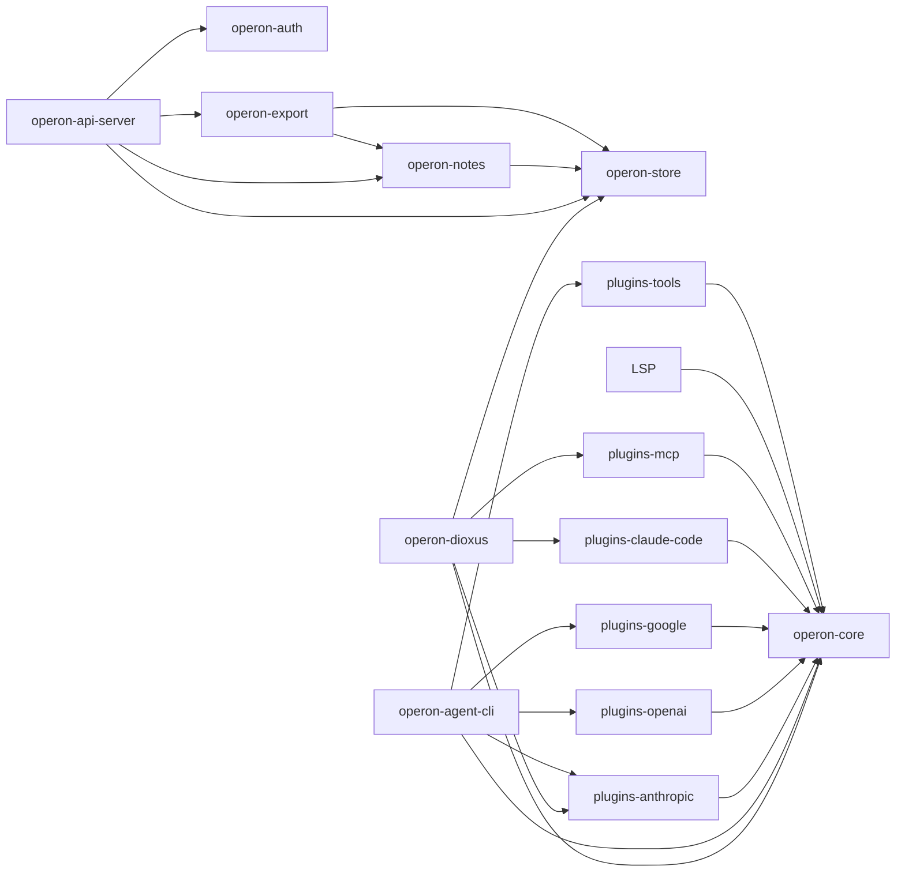
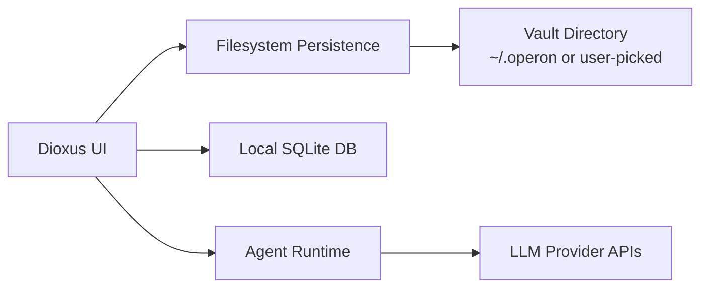
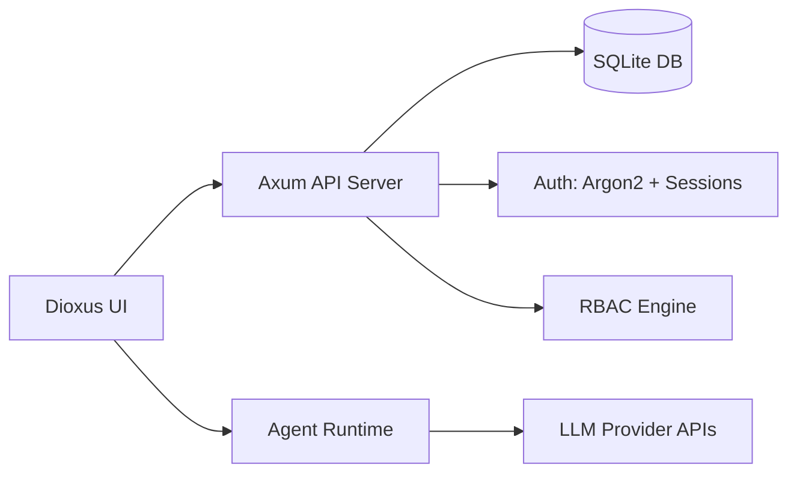
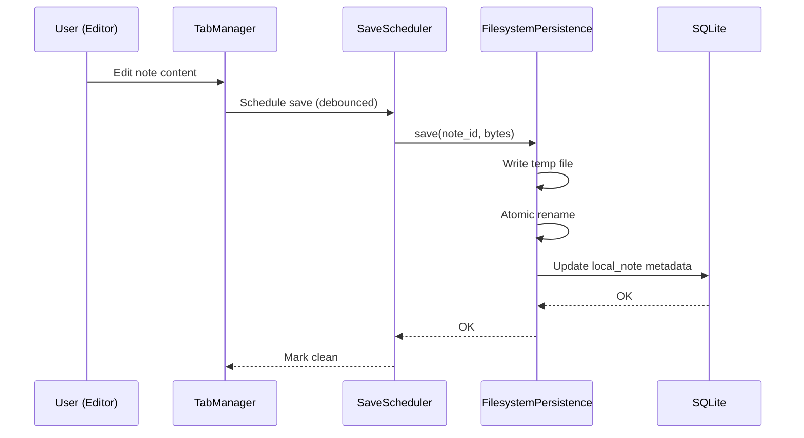
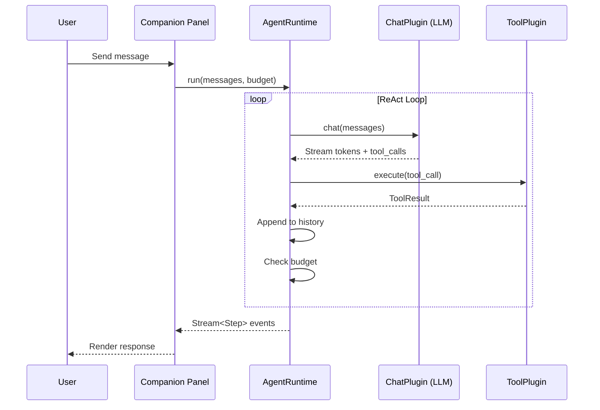
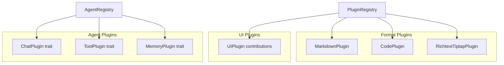
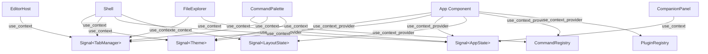
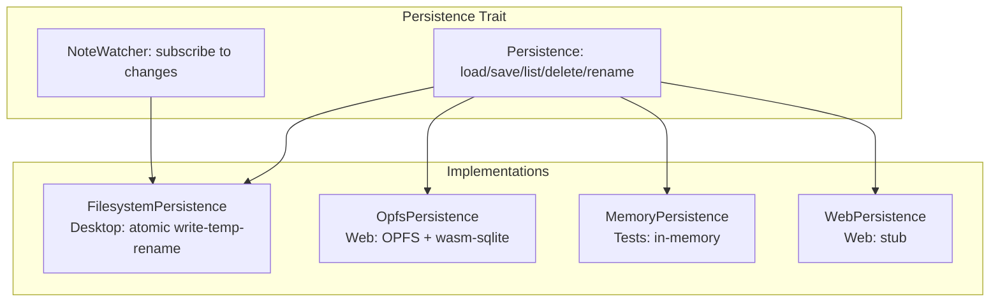

# Architecture

## System Overview

Operon follows a **layered, plugin-driven architecture** with strict separation of concerns enforced at the dependency level via `cargo-deny`. The system is divided into UI, runtime, persistence, auth, and API layers.

```mermaid
graph TB
    subgraph "GUI Layer"
        DX[operon-dioxus<br/>Dioxus 0.7 + Router]
        EB[Editor Bridge<br/>TS: Monaco / CM6 / Tiptap]
    end

    subgraph "Agent Runtime"
        CORE[operon-core<br/>ReAct Loop + Plugin System]
    end

    subgraph "LLM Plugins"
        ANT[operon-plugins-anthropic]
        OAI[operon-plugins-openai]
        GOO[operon-plugins-google]
        CC[operon-plugins-claude-code]
        MCP[operon-plugins-mcp]
        LSP[operon-plugins-lsp]
        TOOLS[operon-plugins-tools]
    end

    subgraph "Data Layer"
        STORE[operon-store<br/>SQLite + Migrations]
        NOTES[operon-notes<br/>Loro CRDT Versioning]
        EXPORT[operon-export<br/>ZIP Archives]
    end

    subgraph "Auth Layer"
        AUTH[operon-auth<br/>Argon2 + RBAC + Sessions]
    end

    subgraph "API Layer"
        API[operon-api-server<br/>Axum REST]
    end

    subgraph "CLI"
        CLI[operon-agent-cli]
    end

    DX --> CORE
    DX --> STORE
    DX --> EB
    CORE --> ANT & OAI & GOO & CC & MCP & LSP & TOOLS
    API --> AUTH & STORE & NOTES & EXPORT
    CLI --> CORE & ANT & OAI & GOO & TOOLS
```

---

## Module Boundaries

### Dependency Constraint (cargo-deny)

```toml
# deny.toml
[[bans.deny]]
name = "dioxus"
wrappers = ["operon-dioxus"]
reason = "operon-core and operon-plugins-* must remain UI-agnostic"
```

Only the root `operon-dioxus` crate may depend on Dioxus. All other crates (core, plugins, store, auth, api-server) are UI-agnostic and can be used independently.

### Crate Dependency Graph



---

## Two-Mode Architecture

Operon operates in two mutually exclusive modes:

### Local Mode



- **Desktop**: Full filesystem access, native directory picker (`rfd`), file watcher (`notify`), OS keyring for secrets
- **Web (wasm-sqlite)**: OPFS-backed persistence, IndexedDB for handles, wasm-compiled SQLite
- **No server required** — everything runs locally

### Cloud Mode (RBAG)



- **Server-backed**: Axum REST API handles data operations
- **Multi-user**: Organization → Department → Team → User hierarchy
- **Audit trail**: All operations logged

---

## Request Lifecycle

### Desktop Note Save Flow



### Agent Chat Flow



---

## Service Interactions

### Plugin System



**Format Plugin trait**:
- `id()` — unique identifier (e.g., `"markdown"`)
- `detect(bytes)` — content-type detection
- `capabilities()` — supported operations
- `language_descriptor()` — editor language config

**Agent Plugin traits**:
- `ChatPlugin` — LLM conversation (streaming)
- `ToolPlugin` — tool execution (file, shell, git, web, LSP)
- `MemoryPlugin` — conversation history persistence

---

## Data Flow

### State Management (Dioxus)



All shared state is provided at the `App` root via `use_context_provider` and consumed by child components via `use_context`. Signals (`Signal<T>`) ensure reactive updates — writing to a signal automatically re-renders all components that read it.

---

## Frontend Architecture

### Editor Bridge

The editor bridge is a **TypeScript layer** that wraps three editor libraries and exposes a unified API to Dioxus via JavaScript interop:

```
Dioxus Component (Rust)
    ↕ JS eval / custom events
TypeScript Bridge (index.ts)
    ↕
Monaco | CodeMirror 6 | Tiptap
```

- **Desktop**: Loaded via custom `bridge://` Wry protocol
- **Web**: Bundled as ESM modules

### Layout System

```
┌─────────┬─────────────────────────┬──────────────┐
│Activity │                         │  Companion   │
│  Bar    │      Editor Area        │   Panel      │
│         │                         │  (Chat/AI)   │
│ [icons] │  ┌─────────────────┐    │              │
│         │  │  Tab Bar        │    │  ┌────────┐  │
│         │  ├─────────────────┤    │  │Sessions│  │
│         │  │                 │    │  │  Rail   │  │
│         │  │  Editor Content │    │  ├────────┤  │
│         │  │                 │    │  │  Chat   │  │
│         │  └─────────────────┘    │  │ Content │  │
│         │                         │  └────────┘  │
├─────────┴─────────────────────────┴──────────────┤
│                  Bottom Panel                     │
│           Logs | Problems | Terminal              │
└──────────────────────────────────────────────────┘
```

- **Sidebar**: 160–600px, collapsible
- **Companion**: 160–∞px, collapsible
- **Panel**: 96–600px, collapsible (default collapsed)
- **Session Rail**: 120–480px (inside companion)
- All regions drag-to-resize via `Splitter` component

---

## Persistence Architecture



**Design principle**: Bytes-only storage. Format parsing (frontmatter, links, JSON) is the responsibility of format plugins, not the persistence layer.
