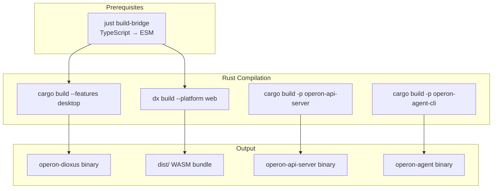

# Build Guide

## Build Targets

Operon produces four separate artifacts:

| Artifact | Command | Output |
|---|---|---|
| Desktop app | `cargo build --release --features desktop` | `target/release/operon-dioxus` |
| Web WASM bundle | `dx build --release --platform web` | `dist/` (HTML + WASM + assets) |
| API server | `cargo build --release -p operon-api-server` | `target/release/operon-api-server` |
| CLI agent | `cargo build --release -p operon-agent-cli` | `target/release/operon-agent` |

---

## Desktop Build

### Development

```bash
cargo run
# Or with dioxus hot-reload:
dx serve
```

### Production

```bash
cargo build --release --features desktop
```

The binary embeds:
- Critical CSS (5 stylesheets via `include_str!`)
- Custom `bridge://` protocol handler for editor bridge assets
- Wry webview configuration

### Bundle Info (Dioxus.toml)

```toml
[bundle]
identifier = "com.operon.dioxus"
publisher = "Operon"
category = "Productivity"
```

---

## Web Build

### Development

```bash
# Prerequisite: build editor bridge
just build-bridge

# Start dev server with hot reload
dx serve --platform web --port 8123
```

### Production

```bash
dx build --release --platform web
```

Output in `dist/`:
- `index.html` — entry point (splash screen, critical styles)
- `*.wasm` — compiled Rust application
- `*.js` — WASM loader
- `assets/` — CSS, editor bridge ESM modules

### WASM-SQLite Feature

For web builds with local SQLite support:

```bash
dx build --release --platform web --features wasm-sqlite
```

**Requirements**: `clang` must be installed (SQLite compiled to WASM).

---

## Editor Bridge Build

The TypeScript editor bridge must be built before web/desktop usage:

```bash
just build-bridge
```

This runs esbuild:
- Input: `assets/editor-bridge/index.ts`
- Output: `assets/editor-bridge/dist/index.js` (ESM format, ES2022 target)
- Bundles: Monaco Editor, CodeMirror 6, Tiptap with all dependencies

---

## API Server Build

```bash
cargo build --release -p operon-api-server
```

The server binary is self-contained with embedded SQLite migrations.

---

## CLI Agent Build

```bash
cargo build --release -p operon-agent-cli
```

Usage:

```bash
./target/release/operon-agent \
    --provider anthropic \
    --model claude-sonnet-4-6 \
    --cwd /path/to/repo \
    "your prompt here"
```

---

## Build Pipeline



---

## Feature Flags

| Feature | Default | Description |
|---|---|---|
| `desktop` | ✅ Yes | Desktop via Wry webview (notify, rfd, arboard, tokio) |
| `web` | No | Web WASM target |
| `mobile` | No | Mobile target (experimental) |
| `wasm-sqlite` | No | Browser SQLite via OPFS (requires clang) |
| `sqlite-memory` | No | In-memory SQLite for testing |

### Crate-Level Features

| Crate | Feature | Description |
|---|---|---|
| `operon-core` | `sqlite-memory` | SQLite-backed memory store |
| `operon-store` | `wasm-sqlite` | WASM SQLite via sqlite-wasm-rs |

---

## Optimization

### Release Profile

The workspace uses default Rust release optimizations. For maximum performance:

```toml
# Add to Cargo.toml if needed
[profile.release]
opt-level = 3
lto = true
codegen-units = 1
strip = true
```

### WASM Size Optimization

```toml
[profile.release]
opt-level = "z"    # Optimize for size
lto = true
```

Use `wasm-opt` for further reduction:

```bash
wasm-opt -Oz dist/*.wasm -o dist/optimized.wasm
```

---

## Build Verification

```bash
# Desktop
cargo build --features desktop && echo "Desktop OK"

# Web
dx build --platform web && echo "Web OK"

# API server
cargo build -p operon-api-server && echo "API OK"

# CLI
cargo build -p operon-agent-cli && echo "CLI OK"

# All tests
just test-all
```

---

## Environment Modes

| Mode | Cargo Features | Target |
|---|---|---|
| Development | `default` (desktop) | Debug build, hot reload |
| Production Desktop | `desktop` + release | Optimized native binary |
| Production Web | `web` + release | Optimized WASM bundle |
| Production Web + SQLite | `web,wasm-sqlite` + release | WASM with local persistence |
| CI/Testing | `desktop,sqlite-memory` | Fast tests with in-memory DB |
