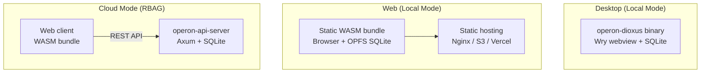

# Deployment Guide

## Deployment Architecture

Operon supports three deployment modes:



---

## Desktop Deployment

### Distribution

The desktop binary is self-contained:

```bash
cargo build --release --features desktop
# Output: target/release/operon-dioxus (+ operon-dioxus.exe on Windows)
```

#### Bundling

Dioxus.toml defines bundle metadata:

```toml
[bundle]
identifier = "com.operon.dioxus"
publisher = "Operon"
category = "Productivity"
```

Use `dx bundle` for platform-specific installers:
- **Windows**: `.msi` / `.exe` installer
- **macOS**: `.app` bundle / `.dmg`
- **Linux**: `.deb` / `.AppImage`

### Requirements

- WebView2 runtime (Windows — pre-installed on Win 10+)
- WebKit2GTK (Linux — installed via package manager)
- macOS 10.15+ (built-in WebKit)

---

## Web Deployment

### Static Hosting

The web build produces a static bundle:

```bash
just build-bridge
dx build --release --platform web
```

Output in `dist/`:
```
dist/
├── index.html
├── *.wasm
├── *.js
├── assets/
│   ├── main.css
│   ├── tailwind.css
│   ├── theme.css
│   ├── shell.css
│   ├── markdown.css
│   └── editor-bridge/dist/
```

Deploy to any static hosting:

#### Nginx

```nginx
server {
    listen 80;
    server_name operon.example.com;
    root /var/www/operon/dist;
    index index.html;

    location / {
        try_files $uri $uri/ /index.html;
    }

    # WASM MIME type
    types {
        application/wasm wasm;
    }

    # Caching
    location ~* \.(wasm|js|css)$ {
        expires 1y;
        add_header Cache-Control "public, immutable";
    }

    # Security headers
    add_header X-Content-Type-Options nosniff;
    add_header X-Frame-Options DENY;
    add_header Referrer-Policy strict-origin-when-cross-origin;
}
```

#### S3 + CloudFront

```bash
aws s3 sync dist/ s3://operon-web/ --delete
aws cloudfront create-invalidation --distribution-id $DIST_ID --paths "/*"
```

---

## API Server Deployment (Cloud Mode)

### Standalone

```bash
cargo build --release -p operon-api-server

# Run with environment variables
OPN_BIND_ADDR="0.0.0.0:7878" \
OPN_DB_PATH="/data/operon.db" \
OPN_HOSTNAME="operon.example.com" \
./target/release/operon-api-server
```

### Docker

Example `Dockerfile`:

```dockerfile
FROM rust:latest AS builder
WORKDIR /app
COPY . .
RUN cargo build --release -p operon-api-server

FROM debian:bookworm-slim
RUN apt-get update && apt-get install -y libsqlite3-0 ca-certificates && rm -rf /var/lib/apt/lists/*
COPY --from=builder /app/target/release/operon-api-server /usr/local/bin/
EXPOSE 7878
ENV OPN_BIND_ADDR="0.0.0.0:7878"
ENV OPN_DB_PATH="/data/operon.db"
CMD ["operon-api-server"]
```

```bash
docker build -t operon-api .
docker run -p 7878:7878 -v operon-data:/data operon-api
```

### Docker Compose

```yaml
version: "3.8"
services:
  api:
    build: .
    ports:
      - "7878:7878"
    environment:
      - OPN_BIND_ADDR=0.0.0.0:7878
      - OPN_DB_PATH=/data/operon.db
      - OPN_HOSTNAME=operon.example.com
    volumes:
      - operon-data:/data
    restart: unless-stopped

volumes:
  operon-data:
```

### Reverse Proxy (Nginx)

```nginx
server {
    listen 443 ssl;
    server_name api.operon.example.com;

    ssl_certificate /etc/ssl/certs/operon.pem;
    ssl_certificate_key /etc/ssl/private/operon.key;

    location / {
        proxy_pass http://127.0.0.1:7878;
        proxy_set_header Host $host;
        proxy_set_header X-Real-IP $remote_addr;
        proxy_set_header X-Forwarded-For $proxy_for;
        proxy_set_header X-Forwarded-Proto $scheme;
    }
}
```

---

## SSL/TLS

The API server does not handle TLS directly. Use a reverse proxy:

- **Nginx** with Let's Encrypt (certbot)
- **Caddy** (automatic HTTPS)
- **Traefik** with ACME

---

## Scaling

### Horizontal Scaling

The API server uses SQLite (single-file database), which limits horizontal scaling:

- **Single instance**: Recommended for most deployments
- **Read replicas**: Use SQLite WAL mode + read-only replicas
- **Migration path**: Replace `operon-store` with PostgreSQL for true horizontal scaling

### Vertical Scaling

- SQLite performs well up to ~100 concurrent users
- WAL mode enables concurrent reads
- Connection pool (r2d2) manages thread-safe access

---

## Rollback Strategy

### Desktop

- Distribute versioned binaries
- Users can keep previous versions alongside new ones

### Web

```bash
# Keep previous build
cp -r dist/ dist-backup/

# Deploy new version
dx build --release --platform web

# Rollback
rm -rf dist/
cp -r dist-backup/ dist/
```

### API Server

```bash
# Keep previous binary
cp operon-api-server operon-api-server.backup

# Deploy new version
# ...

# Rollback
cp operon-api-server.backup operon-api-server
systemctl restart operon-api
```

### Database

SQLite database can be backed up with:

```bash
sqlite3 operon.db ".backup operon-backup.db"
```

---

## Health Checks

The API server exposes standard endpoints for monitoring:

```bash
# Basic connectivity
curl http://localhost:7878/api/me
# Returns 401 if server is running but not authenticated
```

---

## First-Run Bootstrap (Cloud Mode)

On first start, the API server:
1. Creates SQLite database (if not exists)
2. Runs all 16 migrations
3. Creates master admin account (`ensure_master_admin()`)
4. Prints admin credentials to stdout

Save these credentials — they're shown only once.
