# Architecture Flow

```mermaid
graph TB
    subgraph "User Interfaces"
        DESK[Desktop App<br/>Wry Webview]
        WEB[Web App<br/>WASM in Browser]
        CLI[CLI Agent<br/>Terminal]
    end

    subgraph "GUI Layer (operon-dioxus)"
        APP[App Component]
        SHELL[Shell Layout]
        EDITOR[Editor Host<br/>Monaco / CM6 / Tiptap]
        EXPLORER[File Explorer]
        COMPANION[Companion Panel<br/>AI Chat]
        PALETTE[Command Palette]
        TABS[Tab Manager]
    end

    subgraph "Bridge Layer"
        EB[Editor Bridge<br/>TypeScript ESM]
        BRIDGE[bridge:// Protocol<br/>Desktop Only]
    end

    subgraph "Agent Runtime (operon-core)"
        RT[AgentRuntime<br/>ReAct Loop]
        BUDGET[Budget Tracker]
        CONFIG[Config<br/>Figment: TOML + Env]
        SECRETS[SecretStore<br/>Keyring / Env]
    end

    subgraph "LLM Providers"
        ANT[Anthropic<br/>Claude API]
        OAI[OpenAI<br/>Chat Completions]
        GOO[Google<br/>Gemini API]
        CC[Claude Code<br/>CLI Subprocess]
    end

    subgraph "Tool Plugins"
        FILE[File Ops<br/>read/write/glob/edit]
        SHELL_T[Shell<br/>Command Execution]
        GIT[Git<br/>Repository Ops]
        WEB_T[Web<br/>Search / Fetch]
        TASK[Task<br/>Sub-agent Spawning]
        MCP_T[MCP Tools<br/>External Servers]
        LSP_T[LSP<br/>Language Intelligence]
    end

    subgraph "Persistence Layer"
        subgraph "Desktop"
            FS[Filesystem<br/>Atomic Write]
            SQLITE_D[SQLite<br/>rusqlite + r2d2]
            WATCHER[File Watcher<br/>notify crate]
        end
        subgraph "Web"
            OPFS[OPFS<br/>wasm-sqlite]
            IDB[IndexedDB<br/>Handle Persistence]
        end
    end

    subgraph "API Layer (Cloud Mode)"
        API[Axum REST API<br/>operon-api-server]
        AUTH[Auth<br/>Argon2 + Sessions]
        RBAC[RBAC Engine]
        AUDIT[Audit Log]
        SQLITE_S[SQLite<br/>Server DB]
    end

    subgraph "Data Layer"
        STORE[operon-store<br/>Repositories + Migrations]
        NOTES[operon-notes<br/>Loro CRDT]
        EXPORT[operon-export<br/>ZIP Archives]
    end

    DESK --> APP
    WEB --> APP
    CLI --> RT

    APP --> SHELL --> EDITOR & EXPLORER & COMPANION & PALETTE & TABS
    EDITOR --> EB --> BRIDGE

    COMPANION --> RT
    RT --> BUDGET
    RT --> CONFIG & SECRETS
    RT --> ANT & OAI & GOO & CC
    RT --> FILE & SHELL_T & GIT & WEB_T & TASK & MCP_T & LSP_T

    EXPLORER --> FS & SQLITE_D
    TABS --> FS & OPFS
    WATCHER --> EXPLORER

    API --> AUTH & RBAC & AUDIT
    API --> STORE & NOTES & EXPORT
    STORE --> SQLITE_D & SQLITE_S
    NOTES --> STORE
    EXPORT --> STORE & NOTES
```

---

## Layer Descriptions

| Layer | Responsibility |
|---|---|
| **User Interfaces** | Entry points: Desktop (Wry), Web (WASM), CLI |
| **GUI Layer** | Dioxus components, state management, routing |
| **Bridge Layer** | TypeScript↔Rust interop for editor libraries |
| **Agent Runtime** | ReAct loop, budget, config, secrets |
| **LLM Providers** | API clients for each LLM service |
| **Tool Plugins** | Executable tools the agent can invoke |
| **Persistence** | Storage backends (filesystem, SQLite, OPFS) |
| **API Layer** | REST API for multi-user cloud mode |
| **Data Layer** | Shared data abstractions (store, notes, export) |
