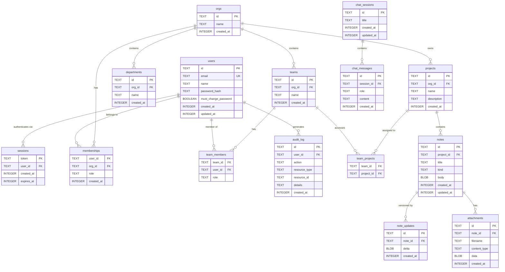
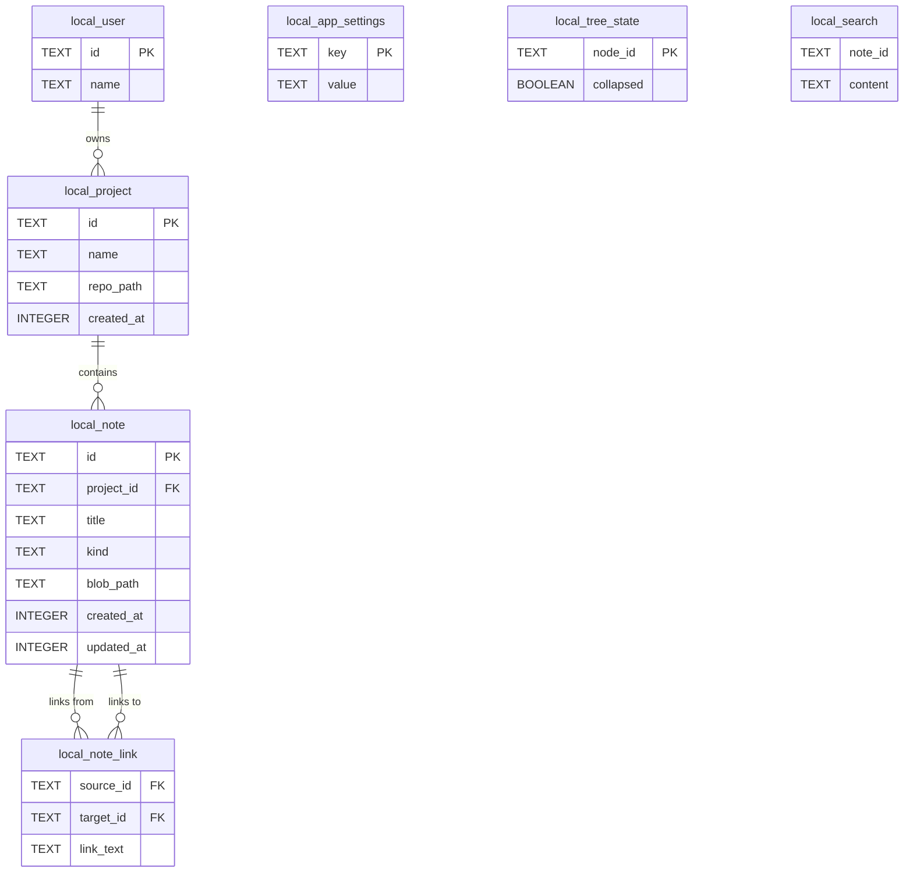
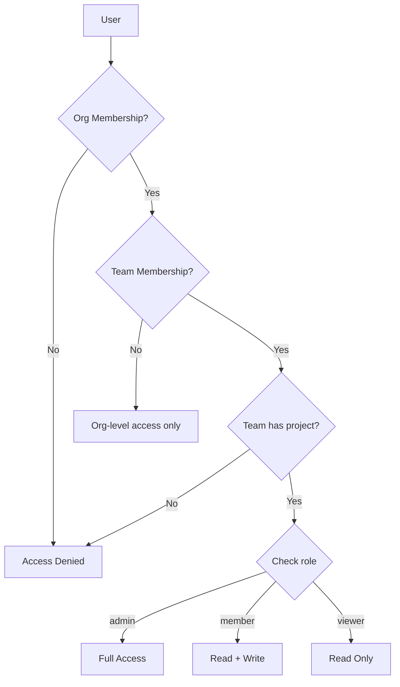

# Database Relations

## Cloud Mode (RBAG) Schema

```mermaid
erDiagram
    users ||--o{ sessions : "authenticates via"
    users ||--o{ memberships : "belongs to"
    users ||--o{ team_members : "member of"
    users ||--o{ audit_log : "generates"

    orgs ||--o{ departments : "contains"
    orgs ||--o{ teams : "contains"
    orgs ||--o{ projects : "owns"
    orgs ||--o{ memberships : "has"

    teams ||--o{ team_members : "has"
    teams ||--o{ team_projects : "accesses"

    projects ||--o{ notes : "contains"
    projects ||--o{ team_projects : "assigned to"

    notes ||--o{ note_updates : "versioned by"
    notes ||--o{ attachments : "has"

    chat_sessions ||--o{ chat_messages : "contains"

    users {
        TEXT id PK
        TEXT email UK
        TEXT name
        TEXT password_hash
        BOOLEAN must_change_password
        INTEGER created_at
        INTEGER updated_at
    }

    sessions {
        TEXT token PK
        TEXT user_id FK
        INTEGER created_at
        INTEGER expires_at
    }

    orgs {
        TEXT id PK
        TEXT name
        INTEGER created_at
    }

    departments {
        TEXT id PK
        TEXT org_id FK
        TEXT name
        INTEGER created_at
    }

    teams {
        TEXT id PK
        TEXT org_id FK
        TEXT name
        INTEGER created_at
    }

    team_members {
        TEXT team_id FK
        TEXT user_id FK
        TEXT role
    }

    memberships {
        TEXT user_id FK
        TEXT org_id FK
        TEXT role
        INTEGER created_at
    }

    projects {
        TEXT id PK
        TEXT org_id FK
        TEXT name
        TEXT description
        INTEGER created_at
    }

    team_projects {
        TEXT team_id FK
        TEXT project_id FK
    }

    notes {
        TEXT id PK
        TEXT project_id FK
        TEXT title
        TEXT kind
        BLOB body
        INTEGER created_at
        INTEGER updated_at
    }

    note_updates {
        TEXT id PK
        TEXT note_id FK
        BLOB delta
        INTEGER created_at
    }

    attachments {
        TEXT id PK
        TEXT note_id FK
        TEXT filename
        TEXT content_type
        BLOB data
        INTEGER created_at
    }

    audit_log {
        TEXT id PK
        TEXT user_id FK
        TEXT action
        TEXT resource_type
        TEXT resource_id
        TEXT details
        INTEGER created_at
    }

    chat_sessions {
        TEXT id PK
        TEXT title
        INTEGER created_at
        INTEGER updated_at
    }

    chat_messages {
        TEXT id PK
        TEXT session_id FK
        TEXT role
        TEXT content
        INTEGER created_at
    }
```

## Local Mode Schema

```mermaid
erDiagram
    local_user ||--o{ local_project : "owns"
    local_project ||--o{ local_note : "contains"
    local_note ||--o{ local_note_link : "links from"
    local_note ||--o{ local_note_link : "links to"

    local_user {
        TEXT id PK
        TEXT name
    }

    local_app_settings {
        TEXT key PK
        TEXT value
    }

    local_project {
        TEXT id PK
        TEXT name
        TEXT repo_path
        INTEGER created_at
    }

    local_note {
        TEXT id PK
        TEXT project_id FK
        TEXT title
        TEXT kind
        TEXT blob_path
        INTEGER created_at
        INTEGER updated_at
    }

    local_note_link {
        TEXT source_id FK
        TEXT target_id FK
        TEXT link_text
    }

    local_tree_state {
        TEXT node_id PK
        BOOLEAN collapsed
    }

    local_search {
        TEXT note_id
        TEXT content
    }
```

## Access Control Flow

```mermaid
graph TB
    USER[User] --> ORG_MEMBER{Org Membership?}
    ORG_MEMBER -->|Yes| TEAM_MEMBER{Team Membership?}
    ORG_MEMBER -->|No| DENIED[Access Denied]
    TEAM_MEMBER -->|Yes| PROJECT_ACCESS{Team has project?}
    TEAM_MEMBER -->|No| ORG_ONLY[Org-level access only]
    PROJECT_ACCESS -->|Yes| ROLE_CHECK{Check role}
    PROJECT_ACCESS -->|No| DENIED
    ROLE_CHECK -->|admin| FULL[Full Access]
    ROLE_CHECK -->|member| WRITE[Read + Write]
    ROLE_CHECK -->|viewer| READ[Read Only]
```
