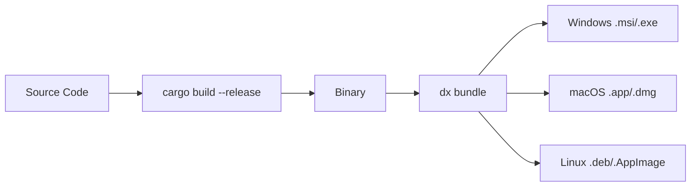
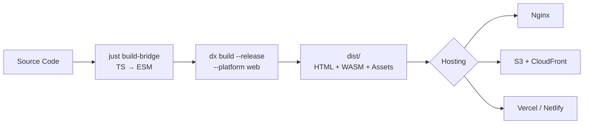
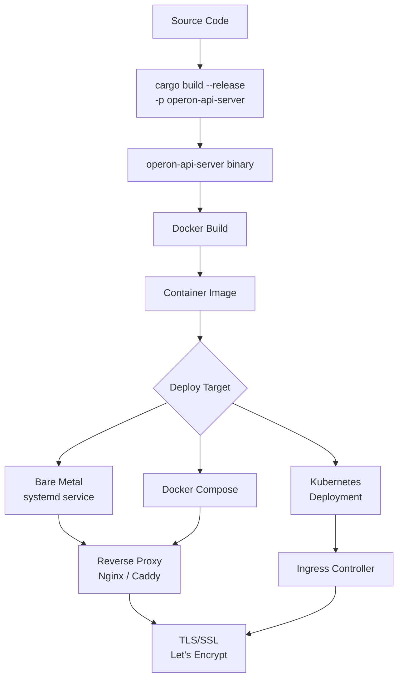
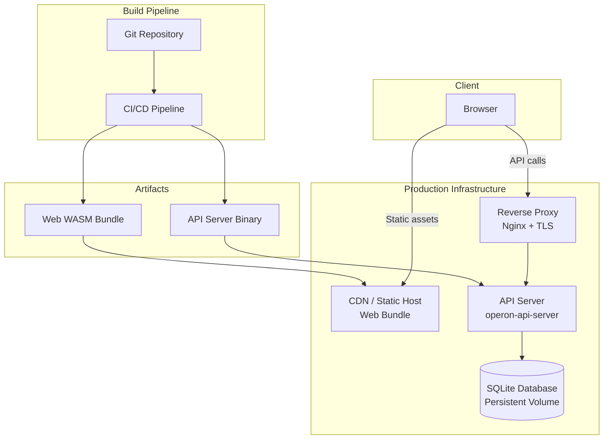
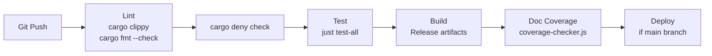
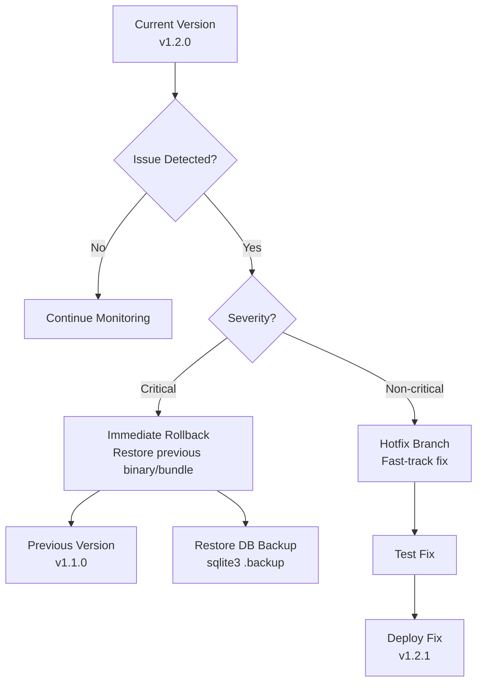

# Deployment Flow

## Desktop Distribution

```mermaid
graph LR
    SRC[Source Code] --> BUILD[cargo build --release]
    BUILD --> BIN[Binary]
    BIN --> BUNDLE[dx bundle]
    BUNDLE --> WIN[Windows .msi/.exe]
    BUNDLE --> MAC[macOS .app/.dmg]
    BUNDLE --> LIN[Linux .deb/.AppImage]
```

## Web Deployment

```mermaid
graph LR
    SRC[Source Code] --> BRIDGE[just build-bridge<br/>TS → ESM]
    BRIDGE --> DX[dx build --release<br/>--platform web]
    DX --> DIST[dist/<br/>HTML + WASM + Assets]
    DIST --> HOST{Hosting}
    HOST --> NGINX[Nginx]
    HOST --> S3[S3 + CloudFront]
    HOST --> VERCEL[Vercel / Netlify]
```

## API Server Deployment

```mermaid
graph TB
    SRC[Source Code] --> BUILD[cargo build --release<br/>-p operon-api-server]
    BUILD --> BIN[operon-api-server binary]

    BIN --> DOCKER[Docker Build]
    DOCKER --> IMAGE[Container Image]

    IMAGE --> DEPLOY{Deploy Target}
    DEPLOY --> BARE[Bare Metal<br/>systemd service]
    DEPLOY --> K8S[Kubernetes<br/>Deployment]
    DEPLOY --> COMPOSE[Docker Compose]

    BARE --> PROXY[Reverse Proxy<br/>Nginx / Caddy]
    K8S --> INGRESS[Ingress Controller]
    COMPOSE --> PROXY

    PROXY --> SSL[TLS/SSL<br/>Let's Encrypt]
    INGRESS --> SSL
```

## Full Stack Deployment (Cloud Mode)

```mermaid
graph TB
    subgraph "Build Pipeline"
        SRC[Git Repository]
        CI[CI/CD Pipeline]
        SRC --> CI
    end

    subgraph "Artifacts"
        WEB_DIST[Web WASM Bundle]
        API_BIN[API Server Binary]
        CI --> WEB_DIST
        CI --> API_BIN
    end

    subgraph "Production Infrastructure"
        CDN[CDN / Static Host<br/>Web Bundle]
        API[API Server<br/>operon-api-server]
        DB[(SQLite Database<br/>Persistent Volume)]
        PROXY[Reverse Proxy<br/>Nginx + TLS]
    end

    WEB_DIST --> CDN
    API_BIN --> API
    API --> DB

    subgraph "Client"
        BROWSER[Browser]
    end

    BROWSER -->|Static assets| CDN
    BROWSER -->|API calls| PROXY
    PROXY --> API
```

## CI/CD Pipeline

```mermaid
graph LR
    PUSH[Git Push] --> LINT[Lint<br/>cargo clippy<br/>cargo fmt --check]
    LINT --> DENY[cargo deny check]
    DENY --> TEST[Test<br/>just test-all]
    TEST --> BUILD[Build<br/>Release artifacts]
    BUILD --> DOCS[Doc Coverage<br/>coverage-checker.js]
    DOCS --> DEPLOY[Deploy<br/>if main branch]
```

## Rollback Strategy

```mermaid
graph TB
    CURRENT[Current Version<br/>v1.2.0] --> ISSUE{Issue Detected?}
    ISSUE -->|No| MONITOR[Continue Monitoring]
    ISSUE -->|Yes| SEVERITY{Severity?}
    SEVERITY -->|Critical| ROLLBACK[Immediate Rollback<br/>Restore previous binary/bundle]
    SEVERITY -->|Non-critical| HOTFIX[Hotfix Branch<br/>Fast-track fix]
    ROLLBACK --> PREVIOUS[Previous Version<br/>v1.1.0]
    ROLLBACK --> DB_BACKUP[Restore DB Backup<br/>sqlite3 .backup]
    HOTFIX --> TEST_FIX[Test Fix]
    TEST_FIX --> DEPLOY_FIX[Deploy Fix<br/>v1.2.1]
```
