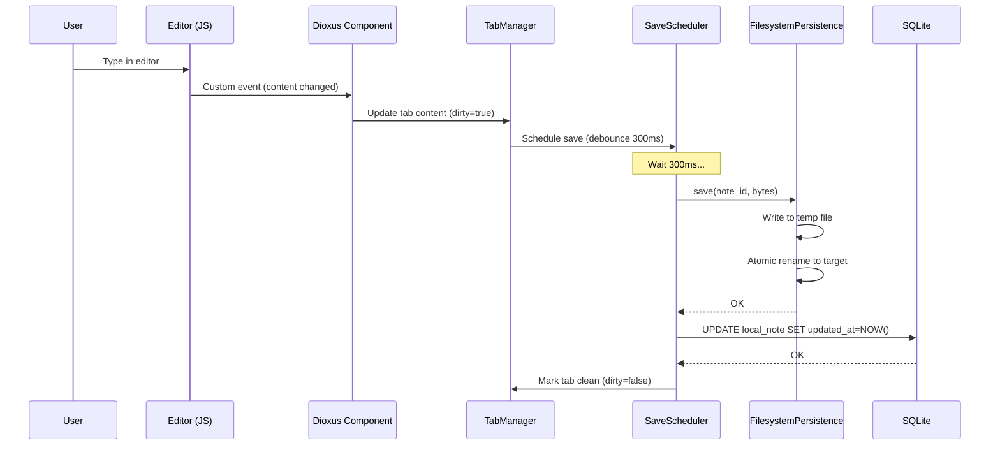
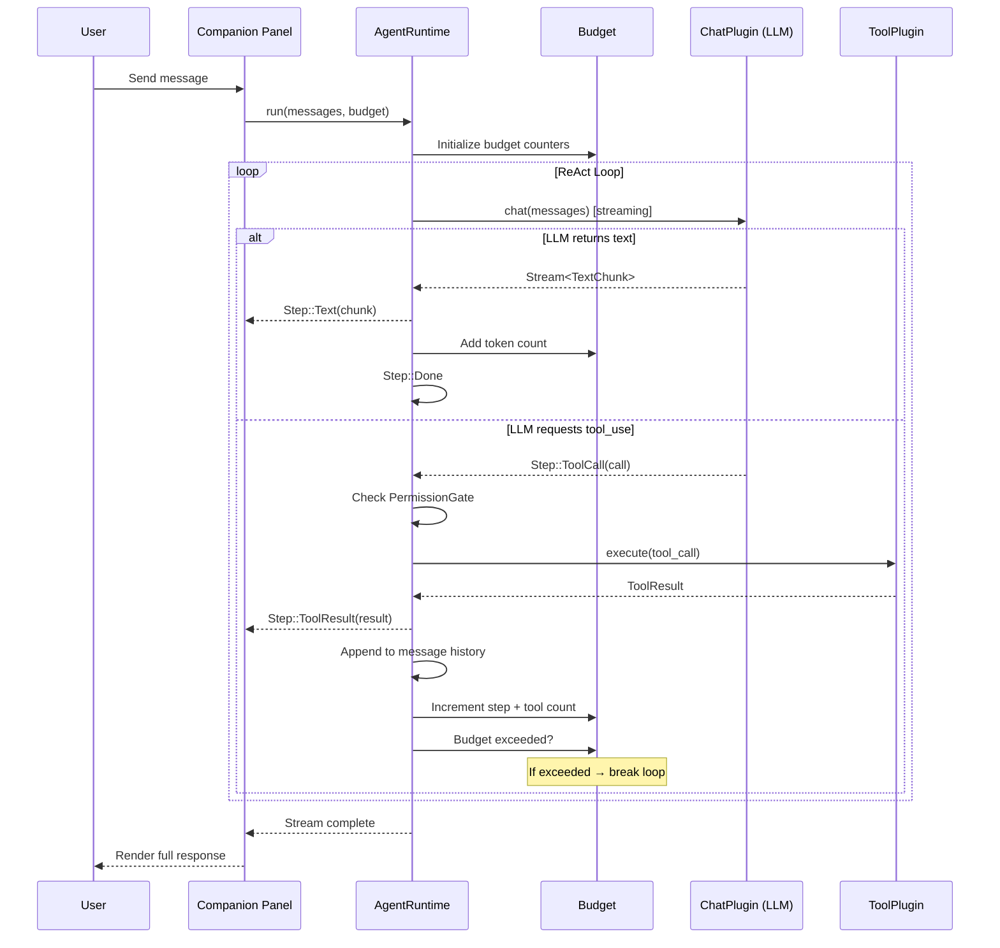
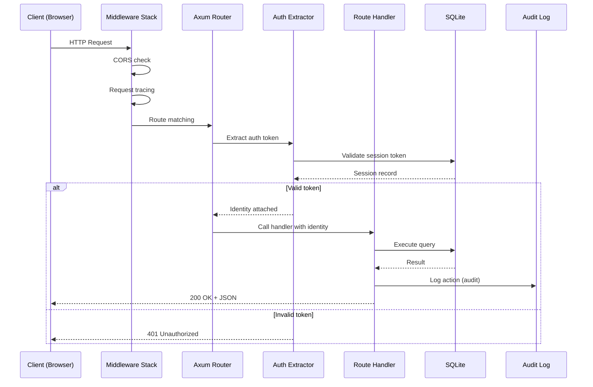
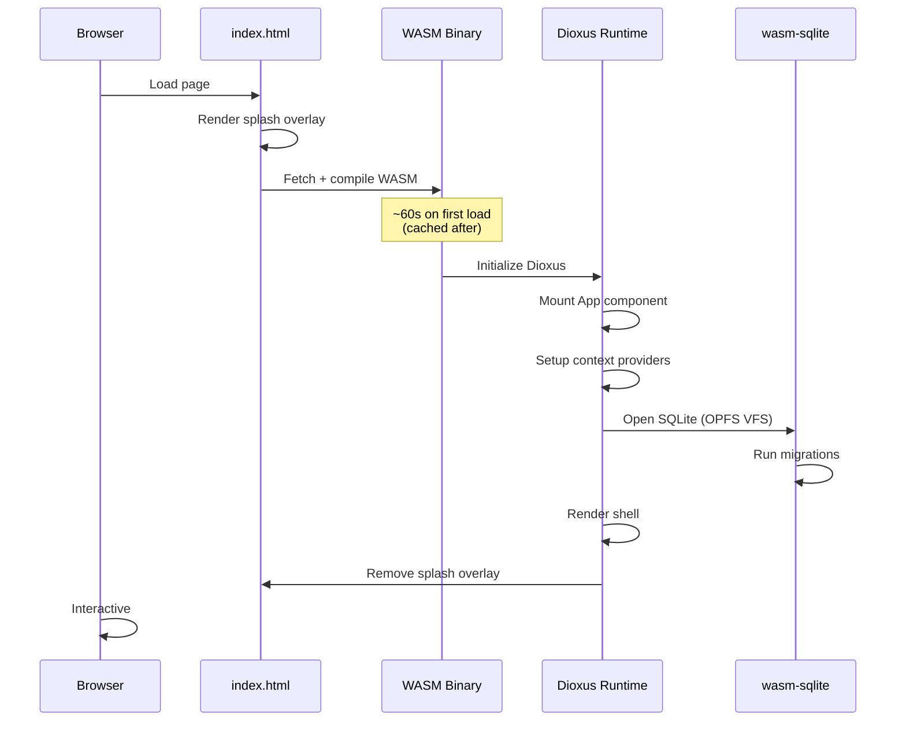
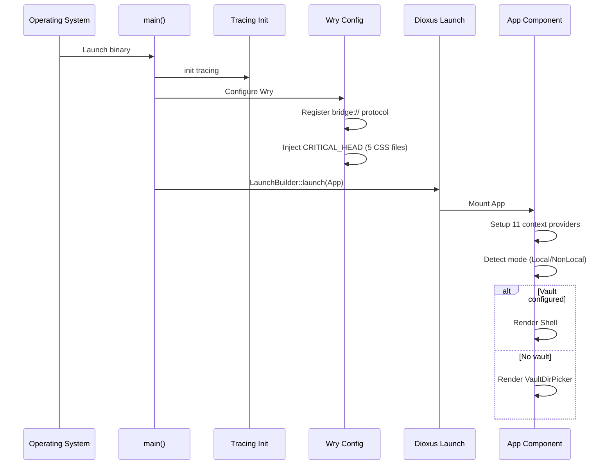

# Request Lifecycle

## Desktop Note Save

```mermaid
sequenceDiagram
    participant U as User
    participant E as Editor (JS)
    participant D as Dioxus Component
    participant TM as TabManager
    participant SS as SaveScheduler
    participant P as FilesystemPersistence
    participant DB as SQLite

    U->>E: Type in editor
    E->>D: Custom event (content changed)
    D->>TM: Update tab content (dirty=true)
    TM->>SS: Schedule save (debounce 300ms)

    Note over SS: Wait 300ms...

    SS->>P: save(note_id, bytes)
    P->>P: Write to temp file
    P->>P: Atomic rename to target
    P-->>SS: OK

    SS->>DB: UPDATE local_note SET updated_at=NOW()
    DB-->>SS: OK
    SS->>TM: Mark tab clean (dirty=false)
```

## Agent Chat Request

```mermaid
sequenceDiagram
    participant U as User
    participant CP as Companion Panel
    participant RT as AgentRuntime
    participant B as Budget
    participant CH as ChatPlugin (LLM)
    participant TP as ToolPlugin

    U->>CP: Send message
    CP->>RT: run(messages, budget)
    RT->>B: Initialize budget counters

    loop ReAct Loop
        RT->>CH: chat(messages) [streaming]

        alt LLM returns text
            CH-->>RT: Stream<TextChunk>
            RT-->>CP: Step::Text(chunk)
            RT->>B: Add token count
            RT->>RT: Step::Done
        else LLM requests tool_use
            CH-->>RT: Step::ToolCall(call)
            RT->>RT: Check PermissionGate
            RT->>TP: execute(tool_call)
            TP-->>RT: ToolResult
            RT-->>CP: Step::ToolResult(result)
            RT->>RT: Append to message history
            RT->>B: Increment step + tool count
            RT->>B: Budget exceeded?
            Note over B: If exceeded → break loop
        end
    end

    RT-->>CP: Stream complete
    CP-->>U: Render full response
```

## API Server Request (Cloud Mode)

```mermaid
sequenceDiagram
    participant C as Client (Browser)
    participant MW as Middleware Stack
    participant AX as Axum Router
    participant EX as Auth Extractor
    participant H as Route Handler
    participant DB as SQLite
    participant AL as Audit Log

    C->>MW: HTTP Request
    MW->>MW: CORS check
    MW->>MW: Request tracing
    MW->>AX: Route matching

    AX->>EX: Extract auth token
    EX->>DB: Validate session token
    DB-->>EX: Session record

    alt Valid token
        EX-->>AX: Identity attached
        AX->>H: Call handler with identity
        H->>DB: Execute query
        DB-->>H: Result
        H->>AL: Log action (audit)
        H-->>C: 200 OK + JSON
    else Invalid token
        EX-->>C: 401 Unauthorized
    end
```

## Web WASM Initialization

```mermaid
sequenceDiagram
    participant B as Browser
    participant HTML as index.html
    participant WASM as WASM Binary
    participant DX as Dioxus Runtime
    participant DB as wasm-sqlite

    B->>HTML: Load page
    HTML->>HTML: Render splash overlay
    HTML->>WASM: Fetch + compile WASM
    Note over WASM: ~60s on first load<br/>(cached after)
    WASM->>DX: Initialize Dioxus
    DX->>DX: Mount App component
    DX->>DX: Setup context providers
    DX->>DB: Open SQLite (OPFS VFS)
    DB->>DB: Run migrations
    DX->>DX: Render shell
    DX->>HTML: Remove splash overlay
    B->>B: Interactive
```

## Desktop Startup

```mermaid
sequenceDiagram
    participant OS as Operating System
    participant M as main()
    participant T as Tracing Init
    participant W as Wry Config
    participant DX as Dioxus Launch
    participant APP as App Component

    OS->>M: Launch binary
    M->>T: init tracing
    M->>W: Configure Wry
    W->>W: Register bridge:// protocol
    W->>W: Inject CRITICAL_HEAD (5 CSS files)
    M->>DX: LaunchBuilder::launch(App)
    DX->>APP: Mount App
    APP->>APP: Setup 11 context providers
    APP->>APP: Detect mode (Local/NonLocal)

    alt Vault configured
        APP->>APP: Render Shell
    else No vault
        APP->>APP: Render VaultDirPicker
    end
```
