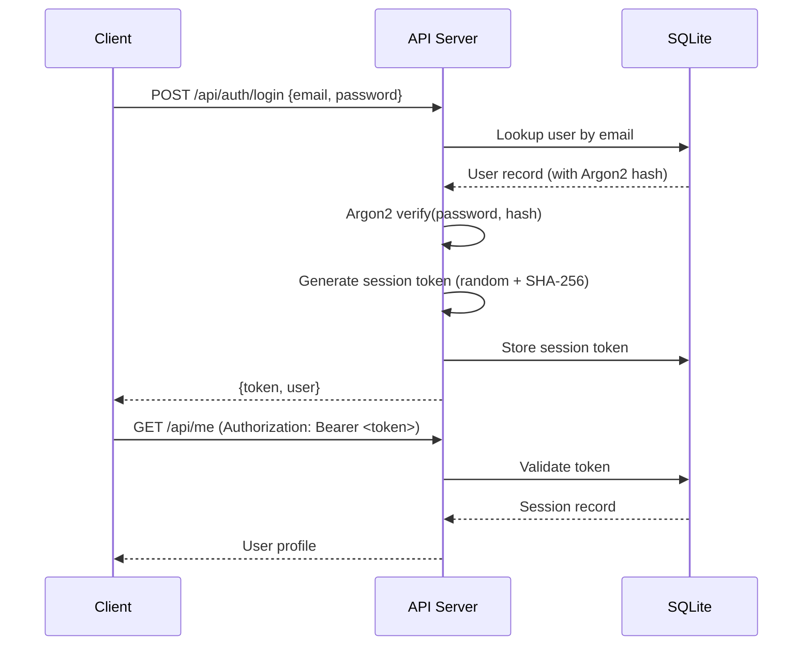

# Security Guidelines

## Authentication Architecture

### Local Mode

No authentication required — single-user, local-only access.

### Cloud Mode (RBAG)



---

## Password Handling

### Hashing

- Algorithm: **Argon2id** (memory-hard, OWASP recommended)
- Library: `argon2` crate
- Salt: Random per-password (auto-generated by library)
- No password stored in plaintext — only hash

### Temporary Passwords

- Admin creates invite with temp password
- User forced to change on first login (`must_change_password` flag)
- Temp passwords follow same Argon2 hashing

---

## Secret Management

### API Keys

| Platform | Storage | Security Level |
|---|---|---|
| Desktop (macOS) | macOS Keychain | Hardware-backed |
| Desktop (Linux) | libsecret / GNOME Keyring | User-session-scoped |
| Desktop (Windows) | Windows Credential Manager | User-scoped |
| Fallback | Environment variables | Process-scoped |
| Server | OS env vars / secrets manager | Deployment-dependent |

### Lookup Chain

```
SecretStore (OS keyring)
    → Environment variable (ANTHROPIC_API_KEY, etc.)
        → Error (key not found)
```

### Never

- Never log API keys
- Never commit API keys to version control
- Never include keys in WASM bundles
- Never send keys to client browsers

---

## Token Handling

### Session Tokens

- Generated: Random bytes → SHA-256 hash
- Stored: `sessions` table in SQLite
- Transmitted: `Authorization: Bearer <token>` header
- Expiration: Checked on each request
- Invalidation: Delete from `sessions` table on logout

### No JWT

Operon uses opaque session tokens (not JWT). Benefits:
- Immediate invalidation (delete from DB)
- No token size concerns
- No crypto key rotation

---

## OWASP Considerations

### A01: Broken Access Control

- **RBAC enforcement**: API endpoints check permissions via `PermissionCheck` middleware
- **Org/Team hierarchy**: Users can only access projects assigned to their teams
- **Audit logging**: All write operations logged to `audit_log` table

### A02: Cryptographic Failures

- **Argon2id** for passwords (not MD5/SHA-1)
- **SHA-256** for content addressing and session tokens
- **rustls-tls** for HTTPS (not OpenSSL)
- No custom crypto implementations

### A03: Injection

- **SQLite**: Parameterized queries via rusqlite (no string interpolation)
- **Path traversal**: `bridge://` protocol rejects `..` segments
- **Input validation**: Axum extractors validate payloads

### A05: Security Misconfiguration

- **cargo-deny**: Enforces dependency constraints, flags vulnerabilities
- **CORS**: Configured via `tower-http` (not wildcard in production)
- **Default deny**: API requires authentication for all endpoints

### A07: Identification and Authentication Failures

- **Argon2id**: Memory-hard hashing prevents brute force
- **Session expiration**: Tokens have TTL
- **Force password change**: Temp passwords must be changed

### A08: Software and Data Integrity Failures

- **Atomic writes**: Desktop uses write-temp-rename pattern
- **CRDT versioning**: Loro prevents data corruption from concurrent edits
- **Content addressing**: SHA-256 for image integrity

### A09: Security Logging and Monitoring Failures

- **Audit log**: All write operations recorded with user, action, resource, timestamp
- **Structured logging**: `tracing` crate with configurable log levels
- **Request tracing**: `tower-http` middleware logs requests

---

## Rate Limiting

- Handled by `tower-http` middleware on the API server
- Not applicable in Local Mode

---

## Path Traversal Prevention

The custom `bridge://` Wry protocol handler rejects path traversal:

```rust
// In main.rs bridge_protocol_handler
if path.contains("..") {
    // Reject request — prevents directory traversal
    return error_response;
}
```

Files are served only from `assets/editor-bridge/dist/`.

---

## Permission System (Agent Runtime)

### PermissionGate

The agent runtime uses glob-based permission rules:

```rust
PermissionGate {
    rules: Vec<PermissionRule>,
}

PermissionRule {
    pattern: GlobPattern,  // e.g., "file:read:**"
    action: Allow | Deny,
}
```

### Grant Handlers (MCP)

| Handler | Behavior | Use Case |
|---|---|---|
| `AutoApproveGrantHandler` | Allow all | Development/testing |
| `DenyAllGrantHandler` | Deny all | Maximum restriction |
| `SecretStoreGrantHandler` | Prompt-based | Production |

### Desktop Repo Permissions

`.claude/settings.local.json` controls what the Claude Code subprocess can access (managed via Repo Permissions panel in UI).

---

## Secure Headers (API Server)

When deployed behind a reverse proxy, configure:

```nginx
add_header X-Content-Type-Options nosniff;
add_header X-Frame-Options DENY;
add_header X-XSS-Protection "1; mode=block";
add_header Referrer-Policy strict-origin-when-cross-origin;
add_header Content-Security-Policy "default-src 'self'";
add_header Strict-Transport-Security "max-age=31536000; includeSubDomains";
```

---

## Dependency Security

### cargo-deny

```bash
cargo deny check advisories   # Check for known vulnerabilities
cargo deny check bans          # Check banned dependencies
cargo deny check licenses      # Check license compliance
```

Runs as part of CI to catch:
- Known CVEs in dependencies
- Banned/unwanted crates
- License violations

### Supply Chain

- All dependencies from crates.io (official Rust registry)
- `Cargo.lock` committed for reproducible builds
- `npm` lockfile committed for JS dependencies
