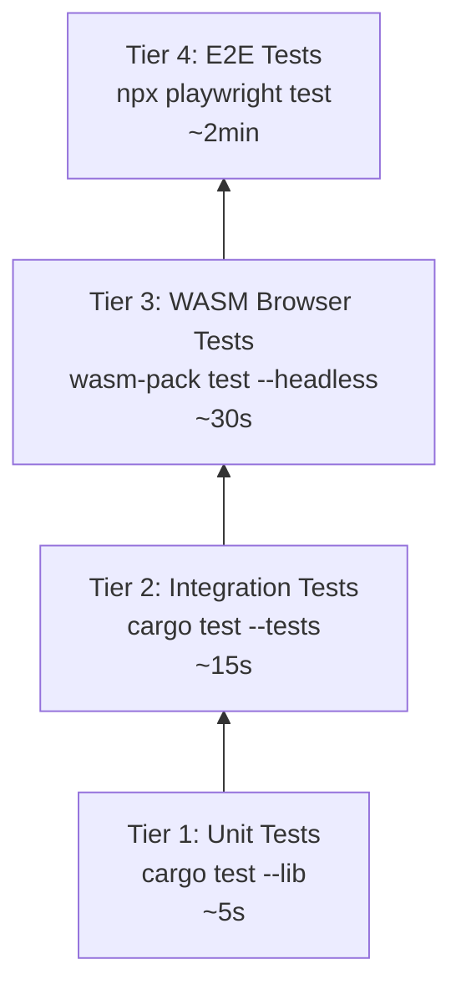

# Testing Guide

## 4-Tier Testing Strategy

Operon uses a tiered testing approach with increasing scope and cost:



---

## Tier 1: Unit Tests

**Command**: `just test-unit` → `cargo test --lib`

**Location**: Inline `#[cfg(test)] mod tests` blocks within source files

**Scope**: Pure logic, no I/O, no database, no network

**Example**:
```rust
#[cfg(test)]
mod tests {
    use super::*;

    #[test]
    fn fuzzy_match_exact() {
        assert!(fuzzy_match("save", "save"));
    }

    #[test]
    fn fuzzy_match_partial() {
        assert!(fuzzy_match("sv", "save"));
    }
}
```

**Guidelines**:
- Test pure functions and data transformations
- No external dependencies (filesystem, network, database)
- Use `assert!`, `assert_eq!`, `assert_ne!`
- Keep tests fast (< 1ms each)

---

## Tier 2: Integration Tests

**Command**: `just test-integration` → `cargo test --tests`

**Location**: `tests/*.rs` files at workspace root

**Scope**: Cross-module interactions, database, mock plugins

### Test Files

| File | What's Tested |
|---|---|
| `agent_runtime.rs` | ReAct loop with echo plugins, budget exhaustion |
| `agent_mcp.rs` | MCP tool proxy integration |
| `agent_runtime_permission.rs` | Permission gate with glob patterns |
| `markdown.rs` | Markdown parsing and rendering |
| `theme_registry.rs` | Theme loading, switching, persistence |
| `vault.rs` | Vault directory operations |
| `plugin_registry.rs` | Plugin registration and lookup |
| `shell_state.rs` | Shell state management |
| `menubar.rs` | Menu bar construction |
| `theme_palettes.rs` | Color palette validation |
| `no_pictographs.rs` | Emoji/pictograph enforcement in source code |

**Example** (agent_runtime.rs):
```rust
#[tokio::test]
async fn three_step_echo_loop() {
    let chat = EchoChatPlugin::new(3);
    let tool = EchoToolPlugin::new();
    let runtime = AgentRuntime::builder()
        .chat_plugin(Box::new(chat))
        .tool_plugin(Box::new(tool))
        .budget(Budget::new().max_steps(10))
        .build();

    let steps: Vec<Step> = runtime.run(messages).collect().await;
    assert_eq!(steps.len(), /* expected */);
}
```

**Guidelines**:
- Use `EchoChatPlugin` and `EchoToolPlugin` for agent tests (no real LLM calls)
- Use `MemoryPersistence` for storage tests
- Use `#[tokio::test]` for async tests
- Each test file should be self-contained

---

## Tier 3: WASM Browser Tests

**Command**: `just test-wasm` (after `just build-bridge`)

**Location**: `tests-wasm/` directory

**Tool**: `wasm-pack test --headless --chrome`

**Scope**: Browser-specific behavior, DOM interaction, WASM runtime

**Prerequisites**:
- Editor bridge built (`just build-bridge`)
- Chrome/Chromium installed
- ChromeDriver version matches (`just sync-chromedriver` if needed)

**Framework**: `wasm-bindgen-test`

```rust
use wasm_bindgen_test::*;

wasm_bindgen_test_configure!(run_in_browser);

#[wasm_bindgen_test]
async fn test_browser_feature() {
    // Test runs in headless Chromium
    // Access web-sys APIs, DOM, etc.
}
```

---

## Tier 4: E2E Tests (Playwright)

**Command**: `just test-e2e` (auto-spawns dev server)

**Location**: `e2e/specs/*.spec.ts`

**Tool**: Playwright (Chromium)

**Scope**: Full user workflows through the browser UI

### Configuration

From `playwright.config.ts`:
- **Test timeout**: 120s (accounts for WASM compile on first run)
- **Expect timeout**: 10s
- **Browser**: Chromium only
- **CI mode**: 2 retries, 1 worker, `.only` forbidden
- **Web server**: Auto-spawns `dx serve --platform web --port 8123`

### Test Specs

| Spec | What's Tested |
|---|---|
| `smoke.spec.ts` | Page loads, title displayed |
| `theme-picker.spec.ts` | Theme switching via command palette |
| `sidebar-collapse.spec.ts` | Sidebar toggle button |
| `note-create.spec.ts` | Create a new note, verify in explorer |
| `multi-select.spec.ts` | Multi-selection with Shift/Ctrl click |
| `image-notes.spec.ts` | Image note creation |
| `explorer-dnd.spec.ts` | Drag-and-drop reordering |
| `explorer-undo.spec.ts` | Undo delete operations |
| `wikilinks.spec.ts` | Wikilink creation and navigation |
| `editor-auto-focus.spec.ts` | Editor auto-focus on tab switch |
| `explorer-context-menu-submenu.spec.ts` | Context menu with submenus |
| `mode-toolbar.spec.ts` | Editor mode switching toolbar |

### Page Object Model

```
e2e/
├── specs/           # Test specifications
├── pages/           # Page objects
│   └── AppShellPage.ts   # Main page object
├── fixtures/        # Test data and setup
└── utils/           # Shared utilities
```

### Writing E2E Tests

```typescript
import { test, expect } from '@playwright/test';

test('create a new note', async ({ page }) => {
    await page.goto('/');
    // Wait for WASM to load
    await page.waitForSelector('#operon-root');

    // Create note via UI
    await page.click('[data-testid="new-note-button"]');
    await expect(page.locator('.note-title')).toBeVisible();
});
```

### Debugging E2E

```bash
just test-e2e-ui                    # Headed UI mode with time-travel
OPERON_E2E_HEADED=1 npx playwright test --debug  # Debug mode
just e2e-report                     # Open HTML report
```

---

## Running Tests

### Individual Tiers

```bash
just test-unit           # Tier 1: ~5s
just test-integration    # Tier 2: ~15s
just test-wasm           # Tier 3: ~30s
just test-e2e            # Tier 4: ~2min
```

### All Tiers (Fail-Fast)

```bash
just test-all
```

Runs tiers 1→4 in order, stops on first failure.

---

## Mocking

### Agent Runtime Mocks

| Mock | Purpose |
|---|---|
| `EchoChatPlugin` | Echoes back messages, optionally requests tools |
| `EchoToolPlugin` | Returns fixed tool results |
| `MockChatPlugin` | Configurable mock responses |

### Persistence Mocks

| Mock | Purpose |
|---|---|
| `MemoryPersistence` | In-memory note storage for tests |

### No Network Mocks

Tests never make real API calls. All LLM interactions use mock/echo plugins.

---

## Test Data (Fixtures)

E2E test fixtures are in `e2e/fixtures/`. Integration test data is embedded in test files.

---

## Coverage

### Rust Coverage

```bash
cargo install cargo-tarpaulin
cargo tarpaulin --out Html
```

### Playwright Coverage

Playwright generates coverage in `test-results/` with:
- Screenshots on failure
- Videos (retained on failure)
- Traces (on retry)

---

## CI Integration

Tests should run in CI with:

```bash
CI=1 just test-all
```

The `CI` environment variable:
- Sets Playwright to 2 retries, 1 worker
- Forbids `.only` blocks in tests
- Enables screenshot/video retention
