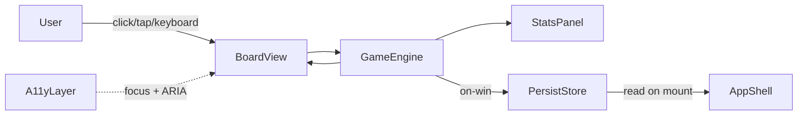

# Architecture: Memory Match

## Context

A browser-only single-player memory game with three board sizes,
themed card art, and `localStorage`-backed personal bests. No backend,
no auth. Mobile-first responsive layout. Target snappy interactions
(<200ms flip latency) and WCAG AA conformance.

## Goals & non-goals

**Goals**
- Snappy, animation-driven gameplay with no perceptible network lag.
- Fully offline-capable after first load.
- Accessible: keyboard navigation, sufficient color contrast, focus
  management.

**Non-goals**
- Multiplayer (deferred to a later release).
- Cross-device sync of personal bests (single-browser only in v1).
- Server-side leaderboards.

## Constraints

- WCAG AA color contrast.
- Card-flip animation ≤ 200ms.
- Total JS bundle ≤ 150 KB gzipped (mobile-first budget).
- Works in evergreen browsers (Chrome / Safari / Firefox) at the
  latest two major versions.

## Stakeholder views

- **Casual player** — opens the page, picks a difficulty, plays a
  round; their best move count + time appears next time they visit.
- **Pilot coordinator** — confirms the game loads on a mid-range
  Android phone in under 3 seconds on 4G.
- **QA** — runs the same flow across the three board sizes and
  verifies the win panel renders correct stats.

## High-level component map

- **AppShell** — page chrome, difficulty picker, theme picker,
  current-game view. Owns top-level state.
- **GameEngine** — pure logic module: deals the deck, tracks face-up
  cards, evaluates matches, computes win condition. Framework-free.
- **BoardView** — renders the grid of cards; receives state from
  GameEngine, fires user-input events back up.
- **CardView** — renders one card; owns its flip animation; exposes
  `face`, `matched`, and `disabled` props.
- **StatsPanel** — move count + elapsed timer; subscribes to engine
  events.
- **PersistStore** — thin wrapper over `localStorage` for personal
  bests; namespace `memory-match:bests:<board-size>`.
- **A11yLayer** — keyboard handler (arrow keys + Enter to flip),
  focus management, ARIA live region for win announcement.

## Architecture diagram



## Data model

`GameState` (in-memory only):
```
{
  deck: Card[]            // shuffled at deal time
  faceUp: number[]        // 0–2 indices currently face-up
  matched: Set<number>    // indices that have been matched
  moves: number
  startedAt: number       // epoch ms
}
```
`Card`: `{ id: number, pairKey: string, themeAsset: string }`.

`PersonalBest` (persisted):
```
{ boardSize: '4x4' | '6x6' | '8x8',
  bestMoves: number,
  bestTimeMs: number,
  recordedAt: number }
```

## Public contracts

GameEngine API (framework-free):
- `deal(boardSize, themeId) -> GameState`
- `flip(state, cardIndex) -> { next: GameState, event: FlipEvent }`
- `isWon(state) -> boolean`
- `elapsedMs(state, nowMs) -> number`

`FlipEvent` ∈ { `flipped` | `matched` | `mismatched` | `ignored` }.

## Tech stack choices

- **TypeScript** (strict mode). Type safety is cheap and the engine
  benefits.
- **React 18** for the view layer. Concurrent rendering helps keep
  flip animations smooth.
- **Vite** for the dev server and bundler. Fast HMR; targets the
  150 KB budget.
- **Tailwind CSS** for layout primitives + accessibility-friendly
  focus rings.
- **Vitest** + **@testing-library/react** for engine + view tests.
- **Playwright** for the cross-browser smoke (one happy-path round
  per board size).
- No state library — `useReducer` in `AppShell` over the GameEngine
  is enough.

## Cross-cutting concerns

- **A11y**: every card is a `<button>` with `aria-pressed` and a
  human-readable `aria-label`. Win announcement uses a polite
  `aria-live` region.
- **Persistence safety**: `localStorage` writes are wrapped in
  try/catch (Safari Private Mode quirk).
- **Animation reduce-motion**: respect `prefers-reduced-motion: reduce`
  by disabling flip animation in favor of instant face swap.

## Risks & mitigations

| Risk | Likelihood | Impact | Mitigation |
|------|------------|--------|------------|
| Mobile rendering jank on 8×8 boards | M | M | Profile early; consider CSS containment + GPU-friendly transforms only. |
| `localStorage` unavailable (Private Mode) | L | L | Detect at startup; PersonalBests becomes session-only with a banner. |
| Theme art bloats bundle past 150 KB | M | M | Inline SVG sprites for v1's one theme; defer extra themes to dynamic import. |
| Reduce-motion users see no feedback | L | M | Replace flip with quick cross-fade; keep match/mismatch color cue. |

## Rollout strategy

- Single static deploy (no feature flag in v1).
- Stage on a preview URL for the pilot group before flipping the prod
  DNS.
- No migration; first-time users start with empty PersonalBests.

## Open questions

- Should v1 ship with 1 theme or 2 themes? — `NON-BLOCKING`
- Reduce-motion fallback — cross-fade vs. instant? — `NON-BLOCKING`

## Revision history

| Revision | Date       | Derived from       | Summary           | Author          |
|----------|------------|--------------------|-------------------|-----------------|
| 1        | 2026-05-11 | master_requirement | Initial seed draft| SA (seed draft) |
